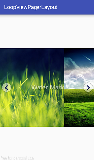
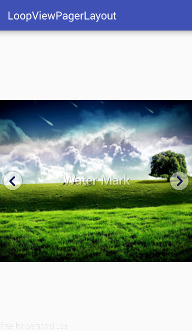

# LoopViewPagerLayout

Viewpager + Loop + Water mark + Right / Left Clamp






## Setup
```java
compile 'com.jaekwon.loopviewpagerlayout.lib:lib:0.1'

```

## USage

in layout

```xml
<com.jaekwon.loopviewpagerlayout.lib.LoopViewPagerLayout
  android:id="@+id/loopViewPagerLayout"
  android:layout_width="match_parent"
  android:layout_height="300dp"/>
```

in MainAcvitiy

```java
public class MainActivity extends AppCompatActivity
{
    @Override
    public void onCreate()
    {
        ...
        LoopViewPagerLayout layout = (LoopViewPagerLayout) findViewById(R.id.loopViewPagerLayout);
        
        List<String> slider_url = new ArrayList<>();
        slider_url.add("https://raw.githubusercontent.com/HaJaeKwon/GnBangExam/master/app/src/main/res/drawable/room1_1.png");
        slider_url.add("https://raw.githubusercontent.com/HaJaeKwon/GnBangExam/master/app/src/main/res/drawable/room2_1.png");
        slider_url.add("https://raw.githubusercontent.com/HaJaeKwon/GnBangExam/master/app/src/main/res/drawable/room3_1.png");
        layout.setSliders_url(slider_url);
        
        //List<Integer> slider_res = new ArrayList<>();
        //slider_res.add(R.drawable.background_1);
        //slider_res.add(R.drawable.background_2);
        //slider_res.add(R.drawable.background_3);
        //layout.setSliders_res(slider_res);
    }
}
```

### Other Options

```java
layout.setLeftClampImage(R.drawable.icon_clamp_right);
layout.setLeftClampSize(100, 100);
layout.setLeftClampGone();
layout.setLeftClampVisible();

layout.setWaterMarkImage(R.drawable.icon_watermark);
layout.setWaterMarkSize(50, 100);
layout.setWaterMarkGone();
layout.setWaterMarkVisible();
```

## Thanks
[square/Picasso](https://github.com/square/picasso) : A powerful image downloading and caching library for Android

[imbruk/LoopingViewPager](https://github.com/imbryk/LoopingViewPager) : An android ViewPager extension allowing infinite scrolling.

## License

  Copyright 2016 JaekwonHa

   Licensed under the Apache License, Version 2.0 (the "License");
   you may not use this file except in compliance with the License.
   You may obtain a copy of the License at

     http://www.apache.org/licenses/LICENSE-2.0

   Unless required by applicable law or agreed to in writing, software
   distributed under the License is distributed on an "AS IS" BASIS,
   WITHOUT WARRANTIES OR CONDITIONS OF ANY KIND, either express or implied.
   See the License for the specific language governing permissions and
   limitations under the License.

